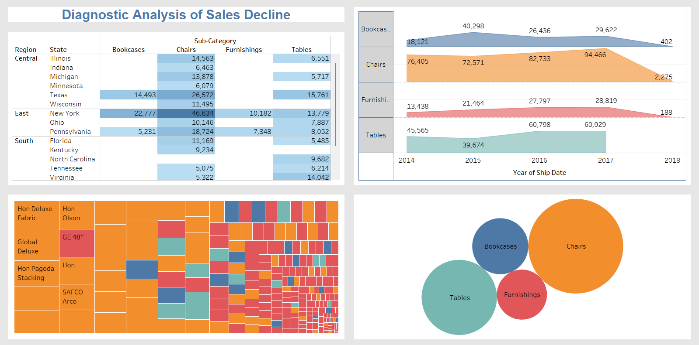

## 📉 Diagnostic Analysis of Sales Decline using Tableau

### 🔍 Overview

This project aims to identify and analyze the reasons behind declining sales performance using **diagnostic analytics techniques** and **interactive Tableau dashboards**. By examining the **Global Superstore dataset**, the project uncovers patterns and problem areas contributing to the drop in sales across regions, product categories, and customer segments.

---

### 🎯 Objectives

* Identify key factors leading to a decline in sales performance.
* Use diagnostic analytics to explore relationships between **sales**, **profit**, **returns**, and **discounts**.
* Build an interactive dashboard to visualize findings and enable stakeholder decision-making.

---

### 📊 Tools & Technologies

* **Tableau** (for visualization & dashboard)
* **Microsoft Excel** (for initial data cleaning)
* **Data Source**: Global Superstore Dataset (Kaggle)

---

### 📌 Key Insights

* High **discount rates** in some segments correlated with reduced profit margins.
* Certain **product categories** had high return rates, negatively affecting overall revenue.
* **Regional performance** varied significantly, with some markets underperforming despite increased marketing efforts.

---

### 📁 Files Included

* `GlobalSuperstore_Dataset.xlsx` – Cleaned dataset used in Tableau
* `Diagnostic_Analysis_Sales.twb` – Tableau workbook file
* `Dashboard_Screenshot.png` – Preview of the dashboard
* `README.md` – Project documentation

---

### 🖥️ Dashboard Highlights

> The interactive Tableau dashboard includes:

* **Sales vs Profit Heatmap**
* **Returns by Product & Category**
* **Discount Impact on Profit**
* **Segment-wise Performance Trends**

### ✅ Skills Demonstrated

* Data Cleaning & Preparation
* Diagnostic Data Analysis
* Business Insight Extraction
* Interactive Dashboard Creation
* Data Storytelling

---

### 📬 Connect with Me

* 💼 [LinkedIn](https://www.linkedin.com/in/faizanfarid-malek-3b1265313)
* 📧 Email: [faizex07@gmail.com](mailto:faizex07@gmail.com)
* 🧠 Portfolio: [GitHub Portfolio](https://github.com/faizan97-malek)

---

Would you like me to help create a matching **project card** for your portfolio website too?
